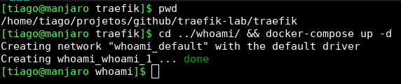

# traefik-lab

Laboratório de estudos para utilizar traefik 1.7 como proxy reverso.

## O lab

Trate-se de um simples laboratório de estudos do [Traefik](https://docs.traefik.io/) como proxy reverso com algumas diferentes aplicações para teste de funcionamento.

### Proxy reverso

-[Traefik](https://docs.traefik.io/)

### Aplicações

- [Containous Whoami](https://github.com/containous/whoami)
- [Composetest](https://docs.docker.com/compose/gettingstarted/) # Retirado do documento [_Geting strted_](https://docs.docker.com/compose/gettingstarted/) do _docker-compose_.
- [Docker Nginx Hostname](https://github.com/stenote/docker-nginx-hostname) # 3 containers de nome ng01, ng02 e ng03.

## Estrutura

```bash
.
├── composetest
├── ng1
│   └── files
│       └── root
│           ├── etc
│           │   └── nginx
│           │       └── conf.d
│           └── run
│               └── nginx
├── ng2
│   └── files
│       └── root
│           ├── etc
│           │   └── nginx
│           │       └── conf.d
│           └── run
│               └── nginx
├── ng3
│   └── files
│       └── root
│           ├── etc
│           │   └── nginx
│           │       └── conf.d
│           └── run
│               └── nginx
├── traefik
└── whoami
```

## Uso

Como testo cada aplicação separadamente, inicio o container _traefik_ e as outras em seguida para analisar seu comportamento.

### Ex:

#### Iniciando o containeer _traefik_


#### Iniciando o conatiner _whoami_



## Testes

Os testes são simples, utiliza-se o [```curl```](https://curl.haxx.se/) para realizar as requisições HTTP em cada serviço através de seu nome.

### Ex:

Exemplo de uma requisição ao containet _whoami_


## ToDo

- [ ] Explanação do arquivo ```traefik.toml``` e cada ``'docker-compose```
- [ ] Uso de SSL com LetsEncrypt
- [ ] Novas imagens _**nginx**_ com conteúdos diversos
- [ ] Comparativo com proxy reverso feito com _nginx_
- [ ] Teste com a versão 2 do _traefik_, incluindo o uso de portas não **HTTP**

## Licença

[MIT](LICENSE.md).
