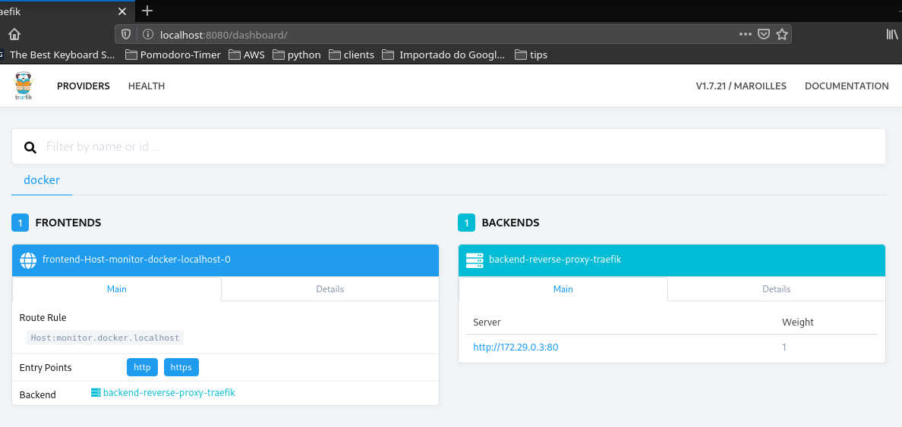

# traefik-lab

Laboratório de estudos para utilizar traefik 1.7 como proxy reverso.

## O lab

Trate-se de um simples laboratório de estudos do [Traefik](https://docs.traefik.io/) como proxy reverso com algumas diferentes aplicações para teste de funcionamento.

### Proxy reverso

- [Traefik](https://docs.traefik.io/)

### Aplicações

- [Containous Whoami](https://github.com/containous/whoami)
- [Docker Nginx Hostname](https://github.com/stenote/docker-nginx-hostname) # 3 containers de nome ng01, ng02 e ng03.
- [wordpress](https://www.digitalocean.com/community/tutorials/how-to-use-traefik-as-a-reverse-proxy-for-docker-containers-on-debian-9)

## Estrutura

```bash
.
├── images
├── ng1
│   └── files
│       └── root
│           ├── etc
│           │   └── nginx
│           │       └── conf.d
│           └── run
│               └── nginx
├── ng2
│   └── files
│       └── root
│           ├── etc
│           │   └── nginx
│           │       └── conf.d
│           └── run
│               └── nginx
├── ng3
│   └── files
│       └── root
│           ├── etc
│           │   └── nginx
│           │       └── conf.d
│           └── run
│               └── nginx
├── traefik
├── whoami
└── wordpress
```

## Uso

Primeiro, execute o compose do _traefik_, em seguida execute os outros containers para analisar o funcionamento do proxy reverso.

### Exemplos:

#### Iniciando o containeer _traefik_

Navegue até o diretório do traefik e execute:

```bash
cd traefik
```

```bash
docker-compose up -d
```


Após a inicialização do _traefik_ acesse seu dashboard pelo endereço web ```http://localhost:8080```



Cada container "cadastrado" no _traefik_ através do uso da lable ```traefik.frontend.rule=Host:[nome-do-container].docker.localhost``` terá suas principais informações de rota, _backend_ e etc apresentadas no dashboard principal.

## Testes

Os testes são simples, utiliza-se o [```curl```](https://curl.haxx.se/) para realização de requisições HTTP em cada serviço através de seu nome.

### Ex:

Exemplo de uma requisição ao container _whoami_


Nada o impede de acessar cada conainer através do navegador.

## ToDo

- [ ] Explanação do arquivo ```traefik.toml``` e ``'docker-compose```
- [ ] Uso de SSL com LetsEncrypt
- [ ] Atualizar as imagens _**nginx**_ com diferentes conteúdos
- [ ] Comparativo com proxy reverso feito com _nginx_
- [ ] Teste com a versão 2 do _traefik_, incluindo o uso de portas não **HTTP**

## Licença

[MIT](LICENSE.md).
